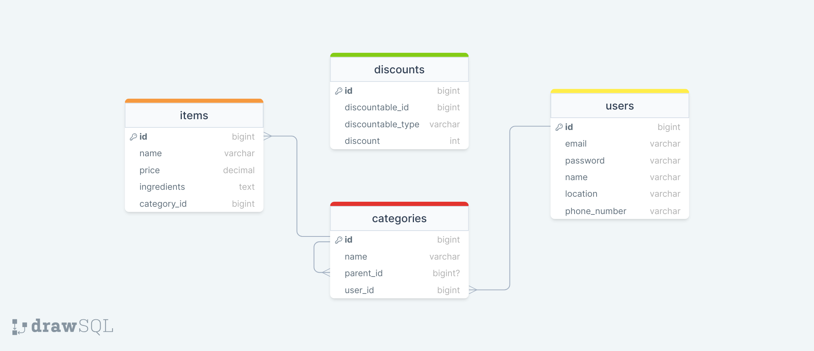

# EverBite Restaurant Menu Management System (Job Application Task) 🍔📊

This project demonstrates a restaurant menu management system built with **Laravel 11**, **Vue 3 Composition API**, and **Inertia** for SSR. It allows restaurants to create and manage categories, subcategories, menu items, and discounts. 🚀

## Development Process 🛠️

### Design Wireframe 📐
### Entity-Relationship Diagram (ERD) 🗂️

The ERD depicts the following tables and their relationships:
- 👥 **Users**: Represents registered restaurants. 
- 🍔 **Categories**: Stores super and subcategories for menu items.
- 🍽️ **Items**: Represents menu items associated with categories. 
- 💰 **Discounts**: Supports various discount types using a one-to-one polymorphic relationship with other entities. 

This approach avoids unnecessary relationships while offering flexibility in managing different discount types. 🔄

### 👩🏻‍💻 Implementation 
- Laravel 11
- Vue 3
- Inertia
- Code Splitting for efficient bundle sizes (See Bundle Analyzer Report) 📦

### 🚀 Deployment 

- See deployed app here: [everbitedashboard.hudashakir.serv00.net](everbitedashboard.hudashakir.serv00.net) 🌐

## Offline Support 📴 

Due to the use of SSR, implementing offline support is currently out of scope. However, alternative approaches like service workers and indexedDB could be explored in the future. 🔮

## Performance 📊
implemented code splitting to achive small bundle size
here you can find the screenshot of bundle analyzer [Link🔗 ](/docs/stats.html)

## Learning Objectives 📚🤓
This project provided an excellent opportunity to learn and apply the following concepts:
- **Laravel Actions:** I explored the use of Laravel Actions to encapsulate complex business logic and improve code organization.  💡
- **SSR with Inertia:** I implemented Server-Side Rendering (SSR) using Inertia.js, which allowed me to leverage the benefits of SEO and initial page load performance while maintaining a reactive user experience. 🌐
- **Web Performance Techniques:** I employed code splitting and analyzed bundle sizes using tools like the Bundle Analyzer to ensure optimal application performance. 🚀

By focusing on these areas, I aimed to demonstrate my ability to learn new technologies and apply them to create a well-structured and performant web application. 🌟
